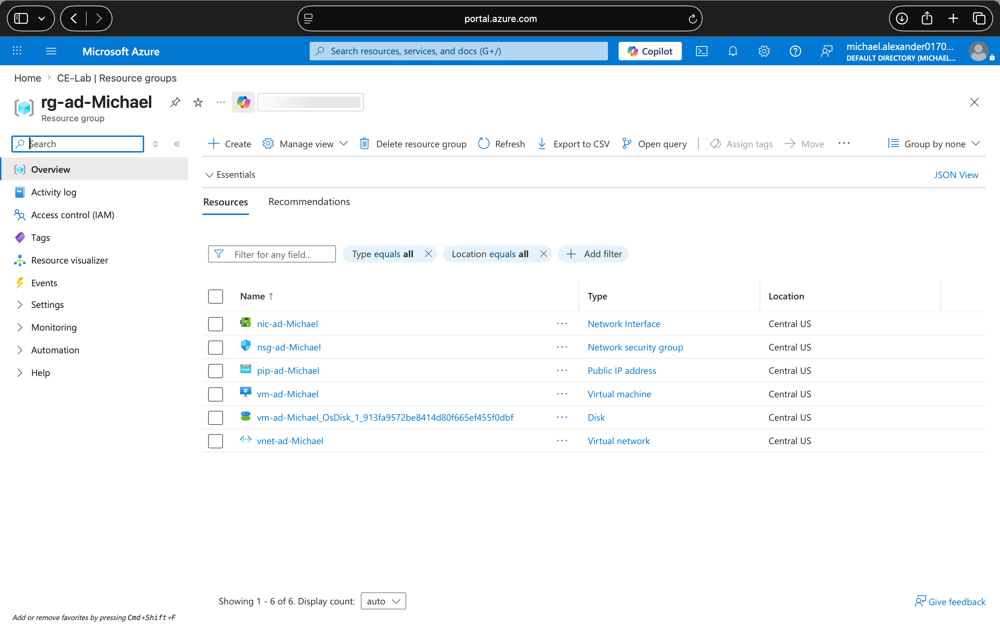

# 🏗️ Azure Active Directory Domain Controller — Terraform Deployment Lab

**Environment:** Windows · Azure CLI · Terraform v1.3+ · Windows Server 2022  
**Cloud Provider:** Microsoft Azure  


---

## 📋 What This Lab Is

This lab takes the Active Directory concepts from the manual lab and automates the entire deployment using Terraform — Infrastructure as Code. Instead of clicking through the Azure Portal to provision a VM and then manually installing AD DS, a single `terraform apply` command provisions every resource and automatically promotes the server to a Domain Controller using a Custom Script Extension that runs PowerShell inline.

This is how infrastructure gets built in real organisations. The manual portal approach teaches you what each resource is. The Terraform approach teaches you how to make it repeatable, version-controlled, and deployable without human intervention — which is the actual skill that separates a junior sysadmin from a cloud engineer.

---

## 🏗️ Architecture

```
┌─────────────────────────────────────────────────────────────────────┐
│  Local Machine                                                       │
│  Terraform CLI · main.tf · variables.tf · outputs.tf                │
└──────────────────────────┬──────────────────────────────────────────┘
                           │ terraform apply
                           ▼
┌─────────────────────────────────────────────────────────────────────┐
│  rg-ad-michael — Azure East US                                      │
│                                                                      │
│  ┌─────────────┐  ┌──────────────┐  ┌───────────────────────────┐  │
│  │    VNet     │  │   Subnet     │  │    NSG                    │  │
│  │ 10.0.0.0/16 ├─▶│ 10.0.1.0/24 │  │    RDP 3389 inbound       │  │
│  └─────────────┘  └──────────────┘  └───────────────────────────┘  │
│                                                                      │
│  ┌────────────────────────────────────────────────────────────────┐ │
│  │  Windows Server 2022 VM — vm-ad-michael                        │ │
│  │  Standard_D2s_v3 · Static IP 10.0.1.4 · Premium_LRS disk      │ │
│  │                                                                │ │
│  │  ┌─────────────────────┐  ┌──────────────────────────────┐    │ │
│  │  │  Public IP (Static) │  │  NIC (Static private IP)     │    │ │
│  │  └─────────────────────┘  └──────────────────────────────┘    │ │
│  │                                                                │ │
│  │  ┌────────────────────────────────────────────────────────┐   │ │
│  │  │  Custom Script Extension                               │   │ │
│  │  │  Installs AD DS + promotes DC via inline PowerShell    │   │ │
│  │  └────────────────────────────────────────────────────────┘   │ │
│  └────────────────────────────────────────────────────────────────┘ │
│                                                                      │
│  ┌────────────────────────────────────────────────────────────────┐ │
│  │  Domain Controller — corp.michael.com                          │ │
│  │  AD DS · DNS · DSRM configured                                 │ │
│  │  Auth: CORP\adadmin or adadmin@corp.michael.com                │ │
│  └────────────────────────────────────────────────────────────────┘ │
└──────────────────────────────────────────────────────────────────────┘
         ▲
         │  RDP port 3389
    Analyst / Admin
```

> The Custom Script Extension is what makes this fully automated. Instead of RDP-ing into the VM and running commands manually, the extension injects a PowerShell command directly into the VM at deployment time — installing the AD DS role and promoting the server to a Domain Controller in a single automated step. The VM reboots automatically once promotion completes.

---

## 🧠 Concepts I Applied

**Infrastructure as Code (IaC)** means defining your infrastructure in configuration files rather than clicking through a portal. The files describe the desired end state and Terraform figures out what needs to be created, modified, or destroyed to get there. Every resource in this lab — the VNet, subnet, NSG, public IP, NIC, VM, and the AD DS configuration — is defined in code and can be deployed identically in any Azure subscription with a single command.

**Terraform providers** are plugins that let Terraform talk to specific platforms. The `azurerm` provider translates Terraform configuration into Azure API calls. The `required_providers` block pins the version to prevent breaking changes from upstream updates — a critical practice in production environments.

**Resource dependencies** in Terraform are mostly automatic. When one resource references another (the NIC references the subnet ID, the VM references the NIC ID), Terraform builds a dependency graph and provisions resources in the correct order without you specifying it manually. You can see this explicitly with `terraform plan`.

**Custom Script Extension** is an Azure VM extension that runs a command or script on a VM after it's provisioned. In this lab it runs a PowerShell one-liner that installs the AD DS Windows feature and calls `Install-ADDSForest` to promote the server — the same commands from the manual lab, but now executed automatically at deploy time without any human intervention.

**Sensitive variables** in Terraform are marked with `sensitive = true` in `variables.tf`. This prevents the values from being printed in plan output or stored in state files in plaintext. Passwords and DSRM credentials should always be marked sensitive — never hardcode them in `main.tf`.

**`terraform.tfvars`** is where you set the actual values for variables. It's separate from `variables.tf` (which just defines the variable names and types) so that sensitive values can be kept out of source control. Always add `terraform.tfvars` to your `.gitignore`.

---

## 🛠️ What I Did

### Step 1 — Scaffolded the Project

Created the project directory and all four Terraform files in one command:

```bash
mkdir -p ~/repos/az-ad-vm && cd ~/repos/az-ad-vm && touch main.tf variables.tf outputs.tf terraform.tfvars
```

---

### Step 2 — Wrote the Terraform Configuration

**`main.tf`** defines every Azure resource and the Custom Script Extension that automates AD DS:

```hcl
terraform {
  required_providers {
    azurerm = {
      source  = "hashicorp/azurerm"
      version = "~> 3.0"
    }
  }
}

provider "azurerm" {
  features {}
}

resource "azurerm_resource_group" "main" {
  name     = "rg-ad-${var.yourname}"
  location = var.location
  tags     = var.tags
}

resource "azurerm_virtual_network" "main" {
  name                = "vnet-ad-${var.yourname}"
  location            = var.location
  resource_group_name = azurerm_resource_group.main.name
  address_space       = ["10.0.0.0/16"]
  tags                = var.tags
}

resource "azurerm_subnet" "main" {
  name                 = "snet-ad"
  resource_group_name  = azurerm_resource_group.main.name
  virtual_network_name = azurerm_virtual_network.main.name
  address_prefixes     = ["10.0.1.0/24"]
}

resource "azurerm_public_ip" "main" {
  name                = "pip-ad-${var.yourname}"
  location            = var.location
  resource_group_name = azurerm_resource_group.main.name
  allocation_method   = "Static"
  sku                 = "Standard"
  tags                = var.tags
}

resource "azurerm_network_security_group" "main" {
  name                = "nsg-ad-${var.yourname}"
  location            = var.location
  resource_group_name = azurerm_resource_group.main.name
  security_rule {
    name                       = "allow-rdp"
    priority                   = 1000
    direction                  = "Inbound"
    access                     = "Allow"
    protocol                   = "Tcp"
    source_port_range          = "*"
    destination_port_range     = "3389"
    source_address_prefix      = "*"
    destination_address_prefix = "*"
  }
  tags = var.tags
}

resource "azurerm_network_interface" "main" {
  name                = "nic-ad-${var.yourname}"
  location            = var.location
  resource_group_name = azurerm_resource_group.main.name
  ip_configuration {
    name                          = "internal"
    subnet_id                     = azurerm_subnet.main.id
    private_ip_address_allocation = "Static"
    private_ip_address            = "10.0.1.4"
    public_ip_address_id          = azurerm_public_ip.main.id
  }
  tags = var.tags
}

resource "azurerm_network_interface_security_group_association" "main" {
  network_interface_id      = azurerm_network_interface.main.id
  network_security_group_id = azurerm_network_security_group.main.id
}

resource "azurerm_windows_virtual_machine" "main" {
  name                  = "vm-ad-${var.yourname}"
  computer_name         = "ad-${var.yourname}"
  location              = var.location
  resource_group_name   = azurerm_resource_group.main.name
  size                  = "Standard_D2s_v3"
  admin_username        = "adadmin"
  admin_password        = var.admin_password
  network_interface_ids = [azurerm_network_interface.main.id]
  os_disk {
    caching              = "ReadWrite"
    storage_account_type = "Premium_LRS"
    disk_size_gb         = 127
  }
  source_image_reference {
    publisher = "MicrosoftWindowsServer"
    offer     = "WindowsServer"
    sku       = "2022-Datacenter"
    version   = "latest"
  }
  tags = var.tags
}

resource "azurerm_virtual_machine_extension" "ad_setup" {
  name                 = "install-ad-ds"
  virtual_machine_id   = azurerm_windows_virtual_machine.main.id
  publisher            = "Microsoft.Compute"
  type                 = "CustomScriptExtension"
  type_handler_version = "1.10"
  settings = jsonencode({
    commandToExecute = "powershell -ExecutionPolicy Unrestricted -Command \"Install-WindowsFeature -Name AD-Domain-Services -IncludeManagementTools; Import-Module ADDSDeployment; Install-ADDSForest -DomainName '${var.domain_name}' -DomainNetbiosName '${var.domain_netbios}' -ForestMode 'WinThreshold' -DomainMode 'WinThreshold' -InstallDns:$true -SafeModeAdministratorPassword (ConvertTo-SecureString '${var.dsrm_password}' -AsPlainText -Force) -Force:$true\""
  })
  tags = var.tags
}
```

**`variables.tf`** defines all variable types and defaults:

```hcl
variable "yourname" {
  description = "Your name — used to make resource names unique."
  type        = string
}

variable "location" {
  description = "Azure region."
  type        = string
  default     = "eastus"
}

variable "admin_password" {
  description = "Local admin password for the VM."
  type        = string
  sensitive   = true
}

variable "dsrm_password" {
  description = "Directory Services Restore Mode password for AD DS."
  type        = string
  sensitive   = true
}

variable "domain_name" {
  description = "Fully qualified domain name (e.g. corp.example.com)."
  type        = string
  default     = "corp.example.com"
}

variable "domain_netbios" {
  description = "NetBIOS name for the domain (max 15 characters)."
  type        = string
  default     = "CORP"
}

variable "tags" {
  description = "Tags to apply to all resources."
  type        = map(string)
  default = {
    project = "ad-lab"
  }
}
```

**`terraform.tfvars`** — actual values (never commit this to source control):

```hcl
yourname       = "michael"
location       = "eastus"
admin_password = "YourPassword123!"
dsrm_password  = "YourDSRMPassword123!"
domain_name    = "corp.michael.com"
domain_netbios = "CORP"
```


**`outputs.tf`** — exposes the public IP after deployment:

```hcl
output "public_ip" {
  description = "Public IP — use this to RDP into the domain controller"
  value       = azurerm_public_ip.main.ip_address
}

output "domain_name" {
  description = "Active Directory domain name"
  value       = var.domain_name
}

output "admin_username" {
  description = "Local admin username"
  value       = "adadmin"
}
```

---

### Step 3 — Deployed

```bash
terraform init    # Downloads the azurerm provider
terraform plan    # Preview what will be created
terraform apply   # Deploy everything
```

Apply takes approximately 5–8 minutes for the VM to provision, then an additional 3–5 minutes for the Custom Script Extension to install AD DS and trigger the automatic reboot.

**📸 Screenshot — Azure Portal showing all six resources deployed successfully in Central US:**



The resource group `rg-ad-Michael` contains all six resources Terraform provisioned — the NIC, NSG, public IP, VM, OS disk, and VNet — all in Central US. This is the exact output of a successful `terraform apply`. Every resource name follows the `*-ad-Michael` naming convention defined by the `yourname` variable in `terraform.tfvars`, which makes it easy to identify lab resources and clean them up with `terraform destroy` when done.

---

### Step 4 — Connected via RDP

```bash
terraform output public_ip
```

Used the returned IP to RDP in. After domain promotion the VM reboots, so local account syntax no longer works — authentication requires the domain prefix:

| Method | Username | When to use |
|---|---|---|
| Domain prefix | `CORP\adadmin` | Standard — use this first |
| UPN format | `adadmin@corp.michael.com` | If domain prefix fails |
| Local account | `.\adadmin` | Only if AD promotion failed |

> Wait at least 5–10 minutes after `terraform apply` completes before RDP-ing in. The VM is still rebooting after AD DS promotion during this window.

---

### Step 5 — Verified AD DS

Once connected, ran these in PowerShell as Administrator to confirm everything was working:

```powershell
# Confirm AD DS service is running
Get-Service NTDS | Select-Object Name, Status

# Confirm domain info
Get-ADDomain

# List domain controllers
Get-ADDomainController -Filter *

# Verify DNS is resolving the domain
Resolve-DnsName corp.michael.com
```

All four returned without errors — the domain controller was fully operational.

---

## ⚠️ Errors Encountered & How I Fixed Them

### Error 1 — VM SKU Not Available in Region (409 Conflict)

**The error:**
```
Error: creating Windows Virtual Machine
(Subscription: "06e93374-6748-40da-9c1b-8fb87b6e5608"
Resource Group Name: "rg-ad-Michael"
Virtual Machine Name: "vm-ad-Michael"):
performing CreateOrUpdate: unexpected status 409 (409 Conflict)
with error: SkuNotAvailable: The requested VM size for resource
'Following SKUs have failed for Capacity Restrictions:
Standard_D2s_v3' is currently not available in location 'eastus'.
```

**Why it happened:**  
Azure regions have finite physical capacity for each VM SKU. `Standard_D2s_v3` was fully allocated in `eastus` at the time of deployment — Azure was not accepting new VMs of that size in that region, regardless of subscription status or free tier eligibility. This is a capacity restriction at the Azure infrastructure level, not a quota or permission issue.

**How I fixed it:**  
Updated the `location` variable in `terraform.tfvars` from `eastus` to `centralus` and re-ran `terraform apply`. The deployment succeeded immediately in the new region.

```hcl
# terraform.tfvars — before
location = "eastus"

# terraform.tfvars — after
location = "centralus"
```

---

**What to do if you can't change regions:**

Sometimes switching regions isn't an option — for example, if other resources in your environment are locked to a specific region and you need everything co-located to avoid cross-region data transfer costs or latency. In that case, try these alternatives:

**Option 1 — Try a different VM SKU in the same region**

The `Standard_D2s_v3` SKU may be unavailable while smaller or newer generation SKUs have available capacity. Check what's available in your target region first:

```bash
az vm list-skus \
  --location eastus \
  --size Standard_D \
  --query "[?restrictions==[]].name" \
  --output table
```

This lists D-series SKUs with no capacity restrictions. Viable alternatives with similar specs:
- `Standard_D2s_v4` or `Standard_D2s_v5` — newer generations, same CPU/RAM profile
- `Standard_B2s` — burstable, lower cost, sufficient for a lab DC

Update `main.tf`:
```hcl
resource "azurerm_windows_virtual_machine" "main" {
  size = "Standard_B2s"   # substitute for Standard_D2s_v3
  ...
}
```

**Option 2 — Request a quota increase for the specific SKU**

If you need that exact SKU in that exact region, you can request Azure increase your allocation via the portal: **Subscriptions → Usage + Quotas → Request increase**. Note that quota increases for free tier accounts are not always approved, and approval can take 24–48 hours.

**Option 3 — Use an availability zone**

Some SKUs are available within specific availability zones of a region even when the region-wide allocation is exhausted. Add a zone specification to the VM resource:

```hcl
resource "azurerm_windows_virtual_machine" "main" {
  zone = "2"   # try zone 1, 2, or 3
  ...
}
```

Note that adding a zone also requires the public IP to be zone-redundant — update it:
```hcl
resource "azurerm_public_ip" "main" {
  zones             = ["2"]
  allocation_method = "Static"
  sku               = "Standard"
  ...
}
```

---

## 🧹 Teardown

```bash
terraform destroy
```

This removes every resource in one command — VM, disks, NIC, public IP, NSG, VNet, subnet, and resource group. Nothing left running, nothing left billing.

---

## 💡 What I Took Away

The biggest shift from the manual lab to this one was understanding what "repeatable" actually means in practice. The manual lab works once, on one machine, for one person. The Terraform configuration works every time, anywhere, for anyone with Azure credentials — and it produces an identical result. That's the actual value proposition of IaC, and hitting the 409 error made it concrete: when I changed one line in `terraform.tfvars` and re-ran apply, the entire stack deployed cleanly in a different region without touching anything else. No portal clicks, no re-doing steps.

The 409 SKU capacity error was also a useful reminder that cloud infrastructure is not infinitely elastic in practice. Regions have real capacity constraints, and building automation that handles failure and retry — or at minimum exposes clear failure modes — is part of production-grade IaC thinking.

---

## 🔍 Verification Commands

```bash
# Check extension provisioning state from local machine
az vm extension show \
  --resource-group rg-ad-michael \
  --vm-name vm-ad-michael \
  --name install-ad-ds \
  --query "provisioningState" \
  --output tsv

# List available SKUs with no restrictions in a region
az vm list-skus \
  --location eastus \
  --size Standard_D \
  --query "[?restrictions==[]].name" \
  --output table
```

---

## 📎 Resources

- [Terraform AzureRM Provider Docs](https://registry.terraform.io/providers/hashicorp/azurerm/latest/docs)
- [Azure VM Custom Script Extension](https://learn.microsoft.com/en-us/azure/virtual-machines/extensions/custom-script-windows)
- [Azure VM SKU Availability by Region](https://azure.microsoft.com/en-us/global-infrastructure/services/)
- [Install-ADDSForest PowerShell Reference](https://learn.microsoft.com/en-us/powershell/module/addsdeployment/install-addsforest)
- [Terraform Best Practices](https://developer.hashicorp.com/terraform/language/style)
